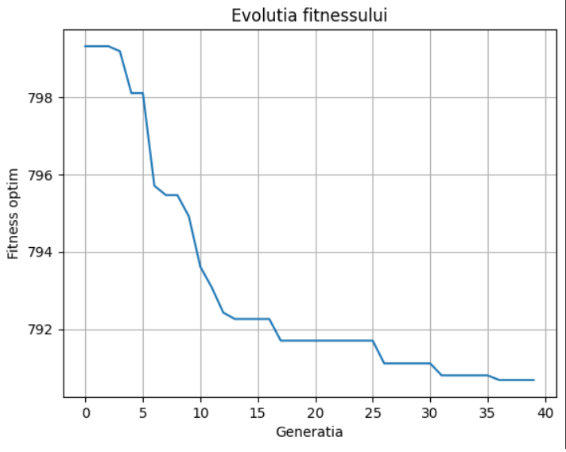
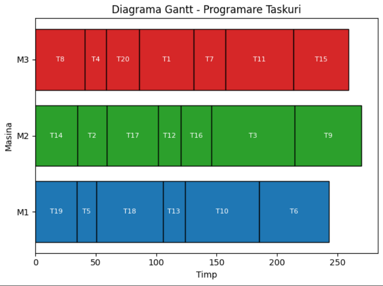

# Smart Factory Task Scheduling Prototype

## Project Purpose
Optimizing the scheduling of tasks in a factory, so that each task is assigned to a suitable machine, in the optimal order, considering both duration and risk.

## Main Features
- Automatic generation of test data (tasks and history)
- Training of AI models that:
  - predict the actual execution time
  - estimate the risk of a task failing
- Optimization of task scheduling on machines using a genetic algorithm
- Displaying the final schedule as a Gantt chart

## Data Generation (for prototype)
As this is a prototype, the data is simulated:
- A history of 100 completed tasks is generated, each with:
  - task type, complexity, machine used, estimated duration, actual duration, error (yes/no)
- Then 20 new tasks are generated that need to be scheduled intelligently

## AI Predictions – what duration and risk mean
- **Actual duration**: the regression model learns how long a task really takes (based on complexity, type, etc.) – this may differ from the estimated duration.
- **Error risk**: the classification model learns, also from history, how likely a task is to fail (not complete successfully). For example, a complex task assigned to an unsuitable machine may have high risk.
- In the fitness score, risk is penalized – a good solution means short time + low risk.

## How the Genetic Algorithm Works
A genetic algorithm (GA) is inspired by biology – it evolves solutions through selection, crossover, and mutation:
- **Individual** = a complete solution (a list of tasks assigned to machines)
- **Population** = a group of individuals (solutions) that are evaluated and compared to each other
- **Fitness** = how good a solution is (in our case: total duration + risk)

### Key Terms
- **Generation**: a full cycle of selection → crossover → mutation → evaluation
- **Selection**: choosing the best solutions (or some random ones with lower probability)
- **Crossover**: two solutions swap parts of their task list
- **Mutation**: a solution is randomly modified (e.g., changing the machine of a task or its order)
- **Repair**: invalid solutions are corrected (e.g., duplicate tasks)

This process repeats for dozens of generations until a very good schedule is obtained.

## Technologies Used
- Python
- Machine Learning: Random Forest
- Optimization: Genetic Algorithm (DEAP)
- Visualization: Matplotlib

## Implementation Steps
- Data generation – simulated history + new tasks
- Model training – AI learns to estimate duration and risk
- Optimization – GA efficiently schedules the tasks
- Gantt display – final schedule is visualized per machine

## Experimental Results (example)

After running the genetic algorithm for 40 generations, the following results were obtained:

Best Schedule:
[('T19', 'M1'), ('T14', 'M2'), ('T2', 'M2'), ('T8', 'M3'), ('T4', 'M3'),  
('T17', 'M2'), ('T5', 'M1'), ('T20', 'M3'), ('T18', 'M1'), ('T13', 'M1'),  
('T12', 'M2'), ('T1', 'M3'), ('T7', 'M3'), ('T10', 'M1'), ('T11', 'M3'),  
('T16', 'M2'), ('T3', 'M2'), ('T15', 'M3'), ('T6', 'M1'), ('T9', 'M2')]

Fitness Score: 790.69

### Other relevant data:
- Best score reached: **799.31**
- Final score obtained: **790.69** (very close to the maximum)
- Diversity maintained in the population: between **0.60 and 0.94** throughout evolution

### Why these results are good

- **Low fitness = efficient scheduling:** the final score is very close to the best achieved in all generations, meaning the algorithm converged to an efficient solution.
- **High diversity:** stagnation in local minima was avoided by maintaining a wide genetic diversity.
- **Balanced distribution:** tasks are well distributed across machines (`M1`, `M2`, `M3`), avoiding bottlenecks.
- **Realistic predictions:** the AI models were trained on 100 historical tasks, providing accurate duration and risk estimations.

### Example data (for transparency):

Historical data (first 5 rows):  
task_type | complexity | required_machine | estimated_duration | real_duration | error  
package   |     3      |        M2        |         44         |       51      |   0  
package   |     3      |        M1        |         12         |       17      |   0  
package   |     4      |        M3        |         33         |       40      |   1  
cut       |     5      |        M2        |         54         |       63      |   0  
cut       |     2      |        M3        |         56         |       66      |   1  

Tasks to be scheduled (first 5):  
T1  | paint    | 5 | M1 | 38  
T2  | assemble | 5 | M1 | 18  
T3  | cut      | 5 | M2 | 59  
T4  | assemble | 1 | M2 | 15  
T5  | cut      | 1 | M1 | 15  

Total tasks generated: 20  
Total historical records: 100

## Visualizations

### Fitness Evolution Over Generations

### Final Gantt Chart

